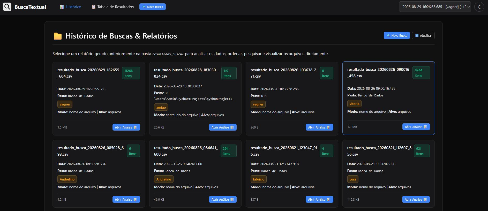
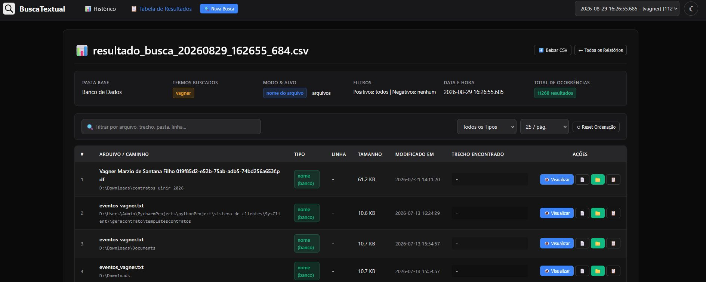
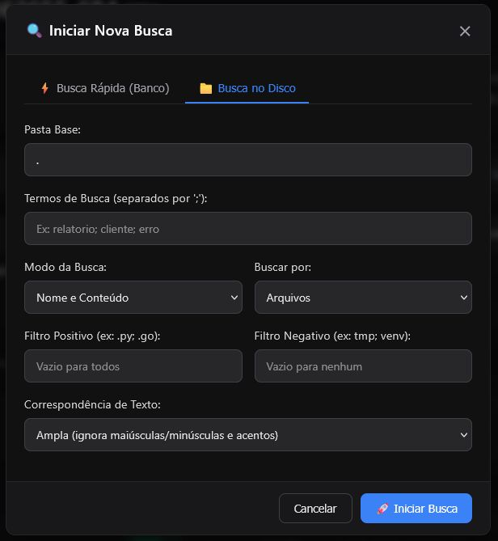
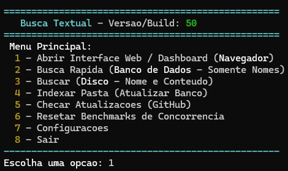

# BuscaTextual

O **BuscaTextual** é uma ferramenta de busca desenvolvida em Go cujo objetivo primário é proporcionar uma **busca por arquivos de forma extremamente rápida**, resultado que alcançamos com excelência tanto em SSDs quanto em HDDs mecânicos de alta capacidade.

Conta com **Interface Web completa no navegador** (com dashboard, tabela interativa, filtros em tempo real, visualizador de código e mídias) e interface de **Linha de Comando (CLI)** colorida. Permite encontrar arquivos por nome, por conteúdo ou por ambos os modos simultaneamente, com filtros inteligentes, paralelismo adaptativo e geração de relatórios auditáveis.

---

## 🖼️ Interface Visual e Telas do Sistema

### 1. Dashboard Principal (Web)
Painel com histórico de relatórios salvos, filtros rápidos e acesso a novas buscas.


### 2. Tabela Interativa de Resultados (Web)
Exibição detalhada com metadados, ordenação dinâmica por colunas, busca instantânea, visualizador de código/mídias integrado e ações no sistema operacional (abrir arquivo no programa padrão e abrir pasta no Explorer).


### 3. Modal de Busca Rápida (Banco de Dados)
Pesquisa ultrarrápida instantânea em arquivos previamente indexados no banco local BoltDB.
.jpg)

### 4. Modal de Busca Completa (Disco)
Busca em disco por nome e conteúdo, com seleção de pasta base, termos múltiplos, filtros positivos/negativos e modos de correspondência.


### 5. Menu Interativo no Terminal (CLI)
Interface de console colorida ANSI com autotuning e menus acessíveis.


---

## 💡 Ideia do projeto

O projeto foi concebido para resolver a necessidade de localizar arquivos e dados com rapidez máxima e simplicidade operacional:

- Buscar arquivos pelo nome de forma instantânea através de índice local.
- Buscar ocorrências de texto dentro do conteúdo dos arquivos.
- Visualizar resultados em tabela interativa no navegador com ordenação e filtros em tempo real.
- Inspecionar arquivos de código, texto, imagens, áudios, vídeos e PDFs diretamente pelo navegador.
- Buscar recursivamente em subpastas com concorrência otimizada por hardware.
- Salvar relatórios estruturados em `.csv`, `.json` ou `.toml` (com `.csv` como padrão).
- Manter o código 100% aberto, transparente, autocontido e fácil de auditar.

---

## 🚀 Desempenho e Performance

O projeto foi projetado com foco em velocidade máxima e eficiência no uso de recursos:

* **Busca e Indexação Ultrarrápidas**: O programa entrega busca e indexação na casa de **1 a 3 segundos**, mesmo em discos rígidos mecânicos de alta capacidade (testado com sucesso em **HD de 6TB**).
* **Paralelismo Adaptativo**: A calibragem automática de threads avalia a velocidade de resposta do hardware em tempo real para extrair o máximo de SSDs rápidos e evitar travamentos por movimentação excessiva da agulha de leitura (*disk thrashing*) em HDDs tradicionais.
* **Leitura sob Demanda**: Relatórios e arquivos são lidos sob demanda diretamente do disco, mantendo o consumo de memória RAM extremamente reduzido.

---

## ⚡ Recursos Principais

* **Interface Web & Dashboard SPA**: Interface visual moderna e autocontida (HTML/CSS/JS embutido no binário) baseada no design system Selectos, com alternador de tema Escuro/Claro.
* **Visualizador Integrado (Preview no Navegador)**:
  - **Código e Texto**: Numeração de linhas, salto automático e destaque na linha exata do resultado encontrado.
  - **Mídias e Documentos**: Suporte nativo para imagens, player de áudio/vídeo e leitor de PDF embutido.
* **Tabela Dinâmica**: Ordenação inteligente de colunas (alfabética, numérica real e cronológica), busca instantânea no cliente e botões para abrir arquivo no programa padrão do SO ou pasta no Explorer.
* **Acompanhamento em Tempo Real**: Barra de progresso ao vivo exibindo arquivos analisados, ocorrências e tempo decorrido com botão de cancelamento.
* **Banco de Dados Local (BoltDB)**: Indexa caminhos e nomes de arquivos em `buscatextual.db` para buscas instantâneas por nome sem precisar reler o disco.
* **Autotuning por Disco**: Benchmark dinâmico (2, 4, 8 e 16 threads) na primeira varredura em cada unidade para calibrar a taxa ótima de I/O.
* **Relatórios Estruturados**: Salva relatórios detalhados com metadados nos formatos **CSV**, **JSON** ou **TOML**.

---

## 📦 Arquivos incluídos no repositório

- Código-fonte completo em Go.
- `build.bat` para compilação rápida no Windows.
- `buscatextual.exe` executável pré-compilado e pronto para uso.
- Pasta `print/` contendo capturas de tela demonstrativas.

---

## 🛠️ Como usar

### 1. Baixar e usar diretamente
Baixe o arquivo `buscatextual.exe` disponível na raiz deste repositório e execute-o. Nenhuma instalação adicional é necessária.

### 2. Acessar a Interface Web
Ao abrir o programa, escolha a opção:
```text
1 - Abrir Interface Web / Dashboard (Navegador)
```
O navegador abrirá automaticamente em `http://127.0.0.1:<porta>`.

### 3. Usar pelo Terminal (CLI)
Você também pode executar buscas diretamente pelo console informando pasta base, termos separados por `;` e filtros.

Exemplo de termos:
```text
erro;cliente;pedido
```

Exemplo de filtros:
```text
.txt;.log;.go
```

---

## 🔨 Como compilar

### Windows via batch
```bat
build.bat
```

### Go direto via terminal
```bash
go build -o buscatextual.exe .
```

### Requisitos para compilar
- Go 1.22 ou superior

---

## 📂 Relatórios gerados

Os relatórios são salvos na pasta:
```text
resultados_busca/
```

Exemplo de nome de arquivo:
```text
resultado_busca_20260829_162655_684.csv
```

---

## 📜 Liberdade de uso

Este projeto é de uso 100% livre para:
- Uso pessoal
- Estudo
- Modificação e derivação
- Redistribuição
- Uso comercial

Veja a licença em [LICENSE](LICENSE).
